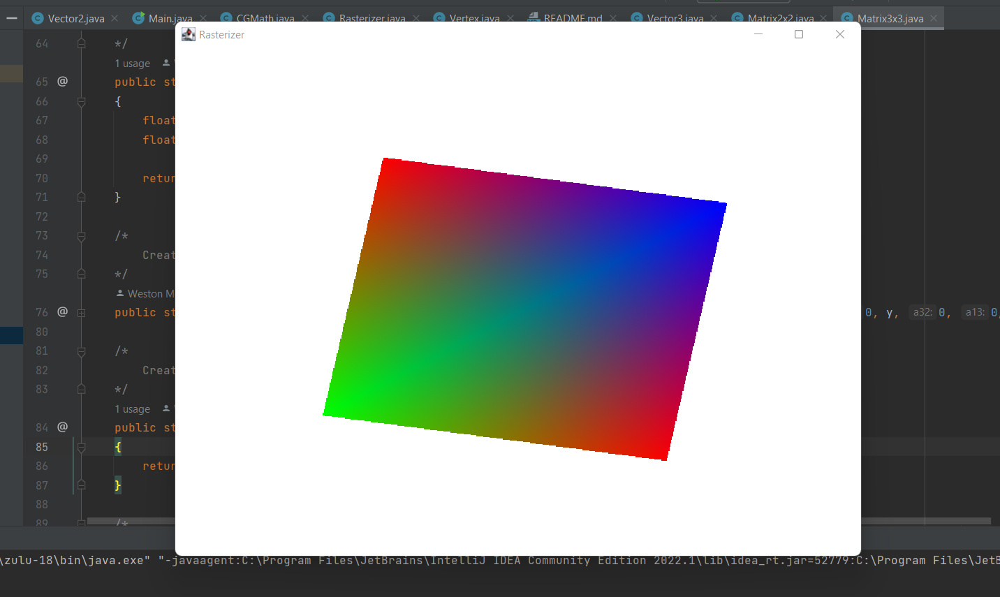

# Java Rasterizer

Simple 2D Java rasterizer with minimal dependencies. Written to learn more about Java.

Contains a simple matrix algebra library to perform calculations, and outputs the rasterized pixels to a framebuffer with AWT.

## Features:
 - Fully contained matrix/CG math library with easy transformation helper functions
 - Barycentric coordinate calculations
 - Can render any amount of 2D triangles
 - Simple API

# Showcase Images

Rendering of a rectangle with interpolated vertex colors using barycentric coordinates

Basic rendering of a triangle