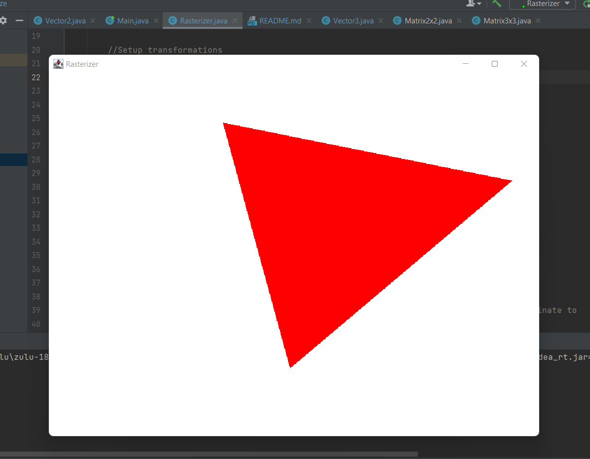

# Java Rasterizer

Simple 2D Java rasterizer with minimal dependencies. Written to learn more about Java.

There are no external dependencies except AWT to output the framebuffer.

Everything else, including the matrix math library is written by me and contained in the project.

Contains a simple matrix algebra library to perform calculations, and outputs the rasterized pixels to a framebuffer with AWT